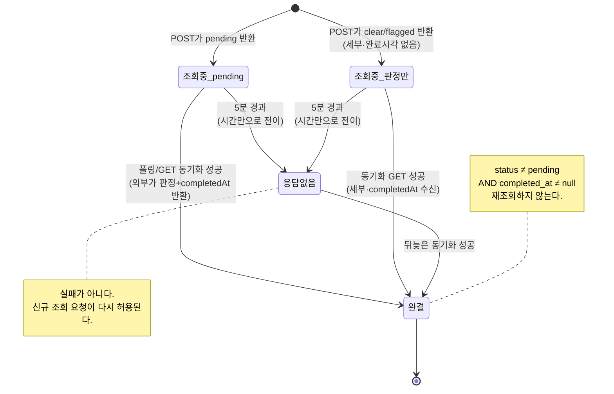
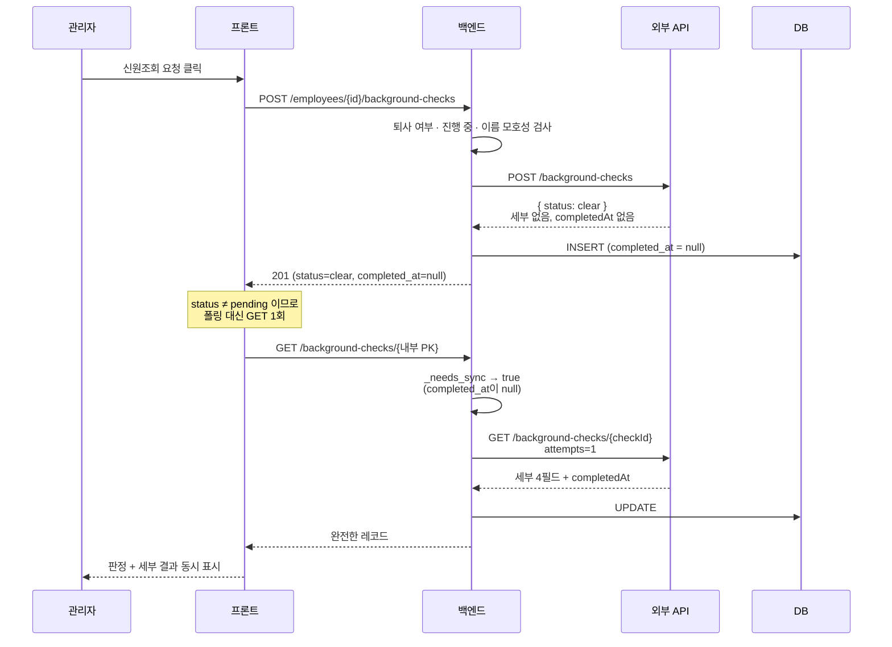
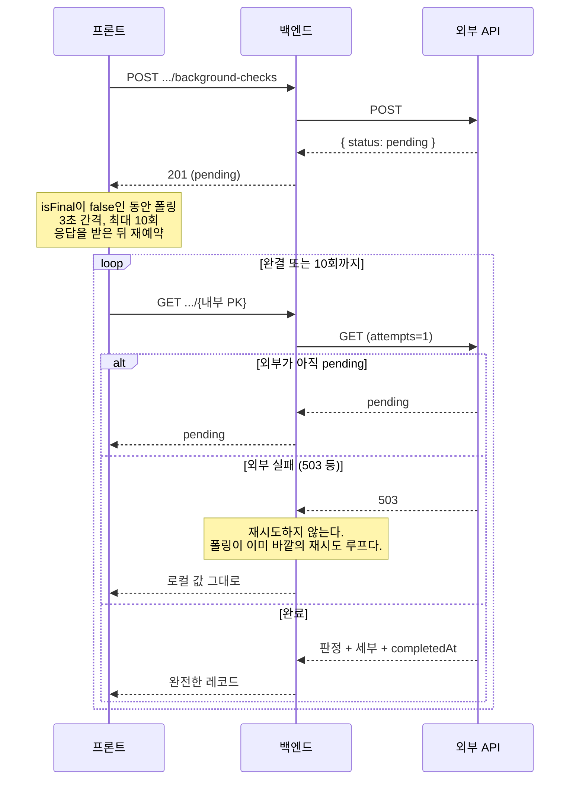
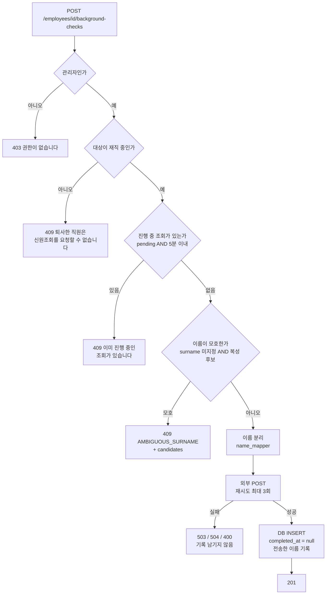
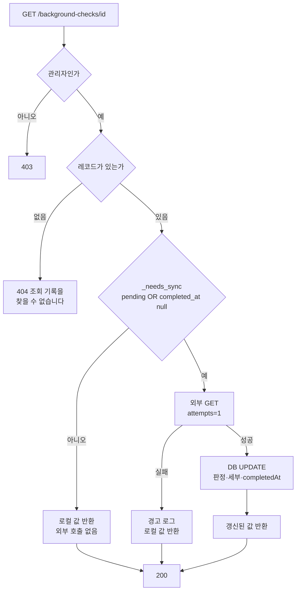
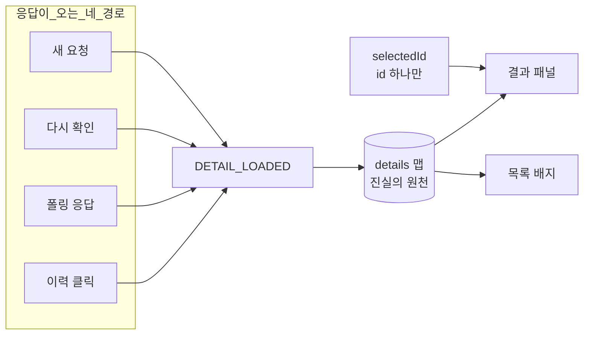
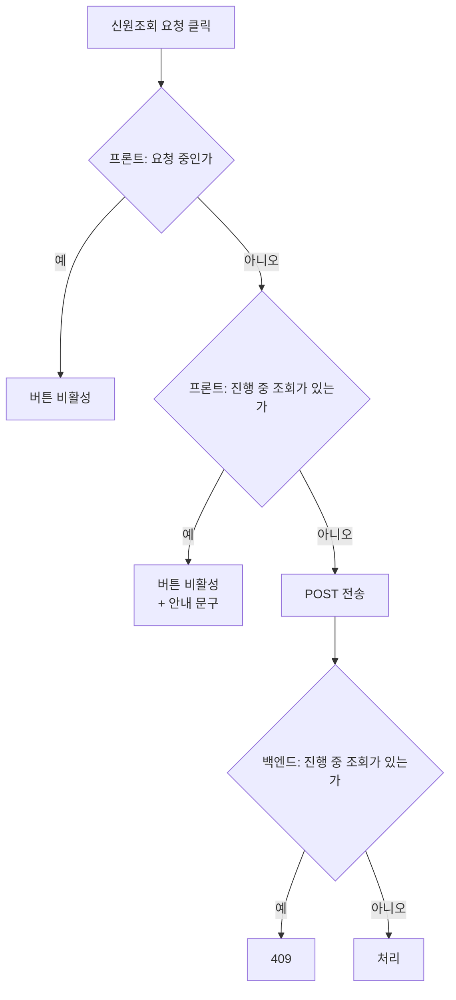

# 신원조회 상태와 흐름

신원조회는 이 시스템에서 상태 조합이 가장 복잡한 영역이다.
외부 API가 비동기이고, 불안정하고, 생성 응답과 조회 응답의 정보량이 다르기 때문이다.

이 문서는 그 상태들을 빠짐없이 나열하고, 무엇이 상태를 바꾸는지 정리한다.
설계 근거는 `docs/04-external-api-integration.md`에, 스키마는 `docs/05-data-model.md`에 있다.

---

## 1. 세 개의 값

상태를 이해하려면 세 값의 성격 차이를 먼저 알아야 한다.

| 값 | 저장 여부 | 출처 | 뜻 |
|---|---|---|---|
| `status` | DB 컬럼 | 외부 API | 판정 (`pending` / `clear` / `flagged`) |
| `completed_at` | DB 컬럼 | 외부 API | 완료 시각. **`null`이면 결과가 아직 안 왔다** |
| `in_progress` | **계산값** | 우리가 파생 | 지금도 기다릴 만한가 |

### `completed_at`이 판정보다 중요한 이유

외부 API는 **생성과 조회의 응답 스키마가 다르다.**

```
POST /background-checks  →  checkId, employeeId, status, createdAt, message
GET  /background-checks/{id}  →  위 + criminalRecord, educationVerified,
                                  employmentVerified, creditScore, completedAt
```

**`POST` 응답에는 세부 결과도 `completedAt`도 없다.**
외부가 즉시 `clear`를 판정해도 우리는 그 근거를 모른다.

따라서 다음 상태가 실제로 존재한다.

```
status:          clear     ← 판정은 안다
completed_at:    null      ← 언제 끝났는지 모른다
criminal_record: null      ← 근거를 모른다
```

**"판정은 들었지만 결과는 없는" 어중간한 레코드**다.
`status`만 보고 완결로 판단하면 "이상 없음"이라는 배지 아래 모든 항목이 "확인 중"인
자기모순 화면이 된다.

그래서 완결 판정은 두 값을 함께 본다.

```python
# 백엔드: 외부에 재확인이 필요한가
def _needs_sync(check) -> bool:
    return check.status == PENDING or check.completed_at is None
```

```typescript
// 프론트: 완결로 볼 것인가 (위 조건의 정확한 반대)
function isFinal(check) {
  return check.status !== 'pending' && check.completed_at !== null
}
```

### `in_progress`를 저장하지 않는 이유

```python
@computed_field
@property
def in_progress(self) -> bool:
    unresolved = self.status == PENDING or self.completed_at is None
    fresh = datetime.now(UTC) - self.requested_at < timedelta(
        seconds=settings.CHECK_IN_PROGRESS_WINDOW_SECONDS   # 5분
    )
    return unresolved and fresh
```

**미완결이면서 아직 최근인 것**만 진행 중으로 본다.

시간 조건이 없으면 교착이 생긴다. 외부가 조회를 잃어버려 `pending`이 영원히 남으면,
"이미 진행 중인 조회가 있습니다" 409가 그 직원의 신규 조회를 영원히 막는다.

이것을 DB 컬럼으로 만들었다면 5분 경과를 감지해 값을 바꿔줄 배치 작업이 필요하다.
계산값이면 **아무도 아무것도 하지 않아도 시간이 알아서 처리한다.**
조회하는 순간의 시각으로 매번 새로 계산되기 때문이다.

파생 가능한 값은 저장하지 않는다는 원칙은 이름 매핑(`docs/03`)에서도 같았다.

---

## 2. 상태 조합표

저장 상태 두 개와 시간 창의 조합이다. 화면 표시는 이 표에서 결정된다.

| # | `status` | `completed_at` | 5분 경과 | `in_progress` | 화면 | 언제 생기는가 |
|---|---|---|---|---|---|---|
| 1 | `pending` | `null` | 아니오 | `true` | **조회 중** | POST가 pending 반환. 정상 진행 |
| 2 | `pending` | `null` | 예 | `false` | **응답 없음** | 외부가 조회를 잃었거나 매우 느림 |
| 3 | `clear`/`flagged` | `null` | 아니오 | `true` | **조회 중** | POST 직후. 동기화 GET 전 |
| 4 | `clear`/`flagged` | `null` | 예 | `false` | **응답 없음** | 동기화가 계속 실패 |
| 5 | `clear`/`flagged` | 있음 | — | `false` | **이상 없음 / 추가 검토 필요** | 완결 |

**3번이 앞서 설명한 어중간한 상태다.** 보통 찰나에 지나간다 —
프론트가 POST 직후 GET을 한 번 더 보내 곧바로 5번으로 만들기 때문이다.
그 GET이 실패하거나 관리자가 즉시 탭을 닫으면 3번으로 남고, 5분 뒤 4번이 된다.

**`pending` + `completed_at` 있음** 조합은 나타나지 않는다.
외부가 `completedAt`을 줄 때는 이미 판정이 확정된 상태다.

### 화면 표시 규칙

```typescript
function displayStatus(check): CheckDisplayStatus {
  if (isFinal(check)) return check.status      // 5번
  return check.in_progress ? 'pending' : 'stalled'   // 1·3 / 2·4
}
```

목록 배지와 결과 패널이 **같은 함수**를 쓴다. 그래서 둘이 어긋날 수 없다.

### "응답 없음"이 "실패"가 아닌 이유

외부 API에는 실패 상태가 없다. `pending` / `clear` / `flagged` 셋뿐이다.
따라서 응답이 오지 않는 것이 **진짜 실패인지 그냥 느린 것인지 알 수 없다.**

"조회 실패"라고 적으면 관리자는 재요청을 시도하는데, 그것이 오히려 정확하지 않다.
뒤늦게 완료되면 판정으로 바뀐다.

---

## 3. 상태 전이도



**시간 경과만으로 일어나는 전이**(조회중 → 응답없음)가 이 설계의 특징이다.
어떤 요청도, 어떤 배치도 필요하지 않다. 조회하는 순간 계산된다.

---

## 4. 시퀀스: 즉시 완료 경로

외부가 POST에 곧바로 `clear`/`flagged`를 반환하는 경우다.



**GET을 한 번 더 보내는 이유**는 POST 응답에 세부가 없기 때문이다.
`pending`이면 이 GET을 건너뛴다 — 어차피 폴링의 첫 GET이 곧바로 나가므로 중복이다.

---

## 5. 시퀀스: pending 폴링 경로



### 동기화 GET이 재시도하지 않는 이유

`http_client`의 재시도 정책(503이면 `retryAfter`만큼 대기, 최대 3회)을 그대로 타면
**이 GET 하나가 1분 가까이 걸린다.** 그동안 프론트는 응답을 받지 못한다.

폴링이 3초 간격으로 계속 다시 오므로 **재시도 루프는 이미 바깥에 있다.**
안에서 또 버티는 것은 같은 일을 더 비싸게 반복하는 것이다.

```python
result = await client.get(check.check_id, attempts=1)
```

`POST`(조회 생성)는 다르다. 그쪽은 재시도가 필요하다 — 요청 자체가 실패하면
조회가 아예 시작되지 않기 때문이다.

### 폴링이 끊겨도 데이터는 유실되지 않는다

탭을 닫든, 다른 화면으로 가든, 10회를 소진하든 `check_id`는 DB에 남아 있다.
다음에 상세를 열면 `_needs_sync`가 다시 외부에 확인한다.

---

## 6. 분기: POST 수신 시 백엔드 검사 순서



**진행 중 검사에 시간 창이 있는 것**이 교착 방지의 핵심이다.
`requested_at > now - 5분` 조건이 없으면 잃어버린 `pending` 하나가
그 직원의 조회를 영구히 막는다.

**외부 호출 실패 시 기록을 남기지 않는다.** `check_id`가 없는 레코드가 생기면
나중에 외부와 대조할 방법이 없다.

---

## 7. 분기: GET 수신 시 동기화 판단



**동기화 실패가 조회 실패가 되지 않는다.** 예외를 넓게 잡아 로컬 값을 반환한다.
외부 API가 죽어도 과거 결과는 보여줄 수 있어야 한다는 것이 결과를 DB에 저장한 이유다
(`docs/01-architecture.md`).

**완결된 레코드는 외부를 호출하지 않는다.** 값이 변할 수 없기 때문이다.
프론트도 같은 판단을 한다 — `isFinal`인 캐시는 재조회하지 않고 즉시 표시한다.

---

## 8. 프론트 상태 구조



같은 조회가 여러 곳에 복사되어 있으면 반드시 어긋난다.
`details: Map<id, 상세>` 하나만 두고, 선택은 **id만** 들고 있는다.
결과 패널과 목록 배지가 같은 맵에서 파생되므로 구조적으로 불일치가 불가능하다.

### 선택과 로딩을 분리하는 이유

상세 GET은 빠르다는 보장이 없다. 미완결 건의 GET은 백엔드가 외부 동기화를 겸하고,
외부가 느리면 시간이 걸린다. 그 사이에 사용자는 다른 항목을 클릭하고,
폴링 응답이 도착하고, 새 요청이 생긴다.

```
selectedId  → 클릭 즉시 반영 (클릭이 씹히지 않는다)
loadingId   → 지금 기다리는 응답의 id
```

`loadingId`가 분리되어 있으므로 **뒤늦게 도착한 응답이 다른 선택을 덮어쓰거나
로딩 표시를 잘못 끄지 않는다.**

---

## 9. 중복 요청 방어선



프론트 비활성화는 UX이고, 백엔드 검사가 실제 방어선이다.
경쟁 조건까지 막는 DB 선점 패턴은 쓰지 않는다 —
관리자 수와 조회 빈도를 고려할 때 발생 확률이 극히 낮고,
발생해도 이력이 하나 더 쌓이는 정도의 영향이다 (`docs/04`).

---

## 10. 상태별 재현 방법

각 상태를 직접 만들어 확인할 수 있다.

| 만들 상태 | 방법 |
|---|---|
| 1 조회 중 (pending) | `FAKE_MODE=always_pending`으로 요청 |
| 2 응답 없음 (pending) | 위 상태에서 5분 대기, 또는 `CHECK_IN_PROGRESS_WINDOW_SECONDS`를 짧게 |
| 3 판정만 있음 | POST는 성공하고 동기화 GET만 실패시켜야 한다. 재현이 까다롭다 |
| 4 응답 없음 (판정만) | 3번 상태에서 창 경과 |
| 5 완결 | `FAKE_MODE=normal` 또는 실제 API |

**2번을 빠르게 재현하려면** 환경변수로 창을 줄인다.

```bash
CHECK_IN_PROGRESS_WINDOW_SECONDS=10 USE_FAKE_API=true FAKE_MODE=always_pending \
  uv run uvicorn app.main:app --reload
```

10초 뒤 이력을 새로고침하면 배지가 "조회 중"에서 "응답 없음"으로 바뀌고,
신원조회 요청 버튼이 다시 활성화된다.

**3번은 DB를 직접 조작하는 편이 빠르다.**

```sql
UPDATE background_checks
SET status = 'clear', completed_at = NULL,
    criminal_record = NULL, education_verified = NULL,
    employment_verified = NULL, credit_score = NULL
WHERE id = ?;
```

---

## 11. 설정값

| 항목 | 값 | 위치 |
|---|---|---|
| 진행 중 판정 창 | 300초 (5분) | `CHECK_IN_PROGRESS_WINDOW_SECONDS` |
| 폴링 간격 | 3초 | `useCheckPolling.POLL_INTERVAL_MS` |
| 폴링 최대 횟수 | 10회 | `useCheckPolling.MAX_ATTEMPTS` |
| 외부 호출 타임아웃 | 10초 | `EXTERNAL_TIMEOUT_SECONDS` |
| 외부 재시도 | 총 3회 시도 | `EXTERNAL_MAX_RETRIES` |
| 동기화 GET 재시도 | **1회** (재시도 없음) | `get_check`에서 `attempts=1` |

**5분**은 외부 완료가 실측상 10초 안팎이고 폴링이 30초면 끝나는 것을 고려해
넉넉하게 잡은 값이다. 짧으면 정상 진행 중인 조회가 "응답 없음"으로 보이고,
길면 교착이 풀리는 데 오래 걸린다.

---

## 관련 문서

- `docs/04-external-api-integration.md` — 재시도·폴링 설계 근거, 배제한 대안
- `docs/05-data-model.md` — `background_checks` 스키마
- `docs/03-name-mapping.md` — 복성 확정 흐름
- `docs/07-walkthrough.md` — 직접 확인 절차
